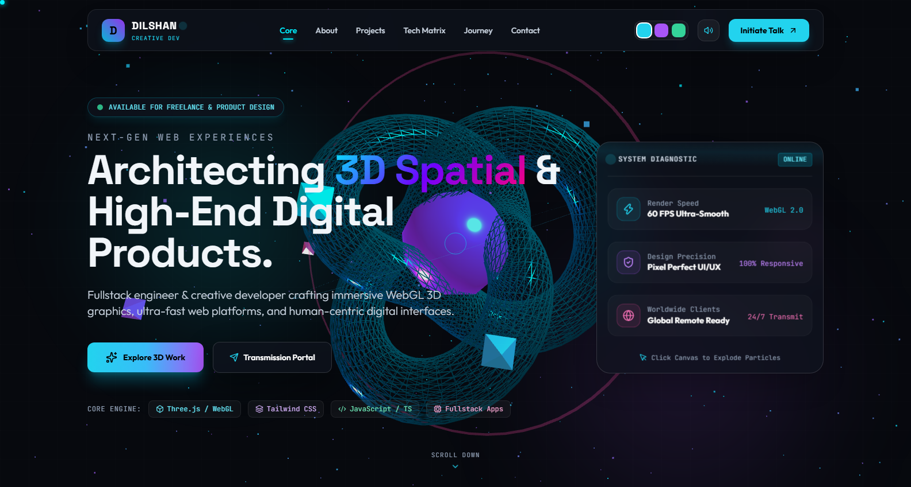
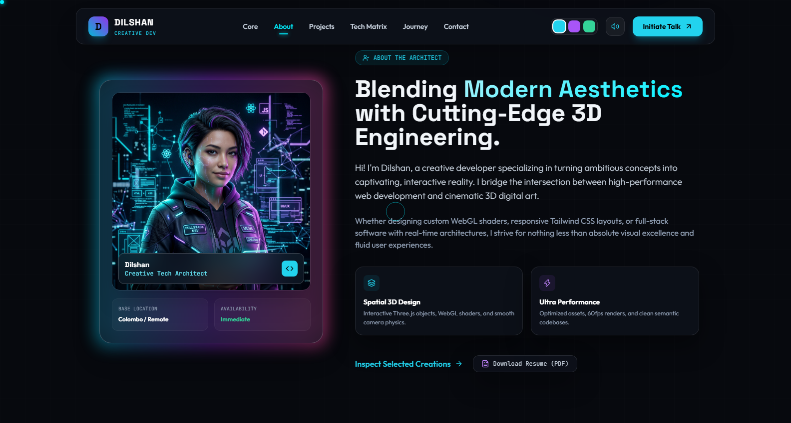
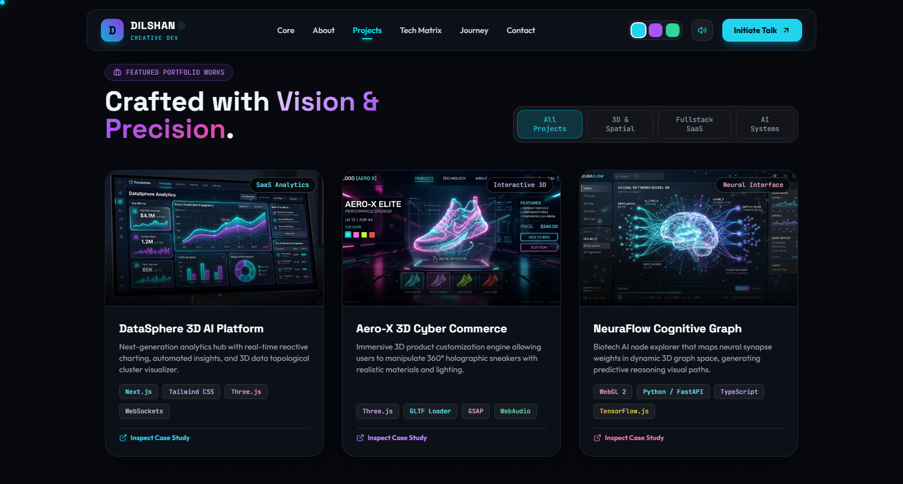
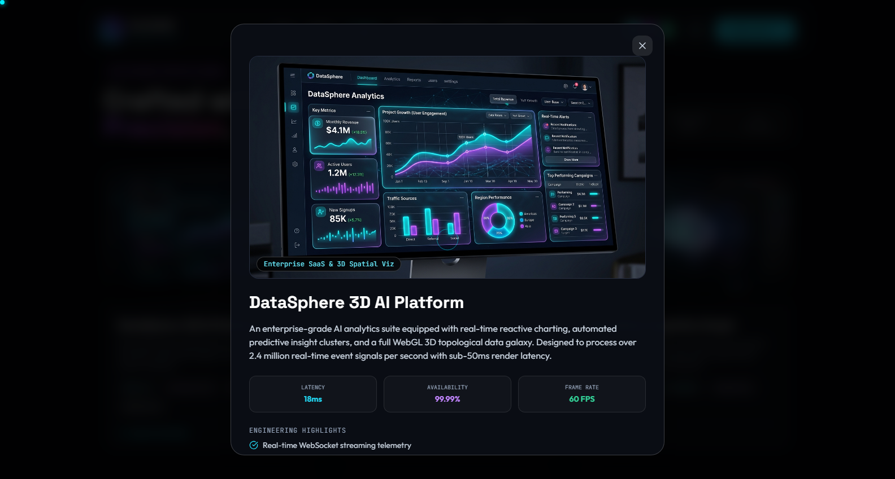
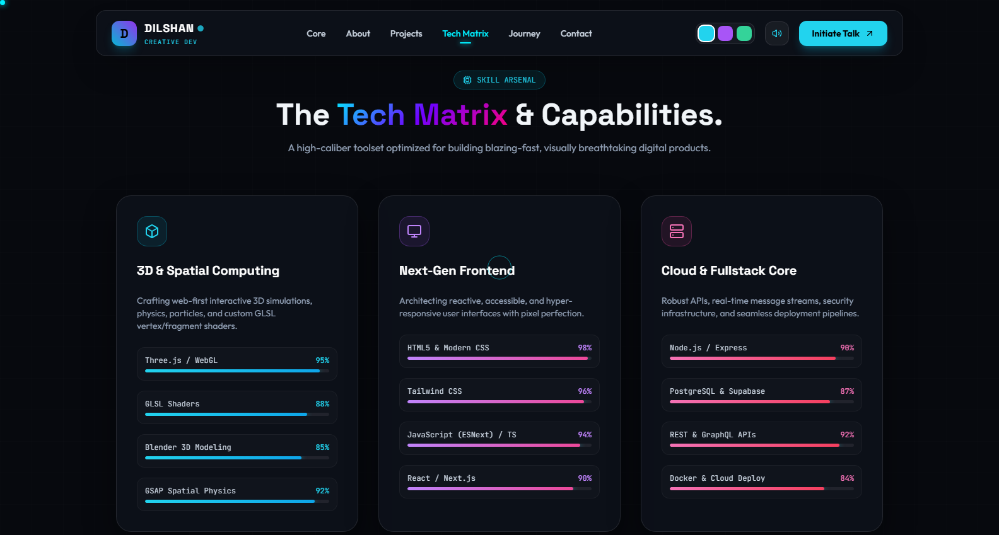
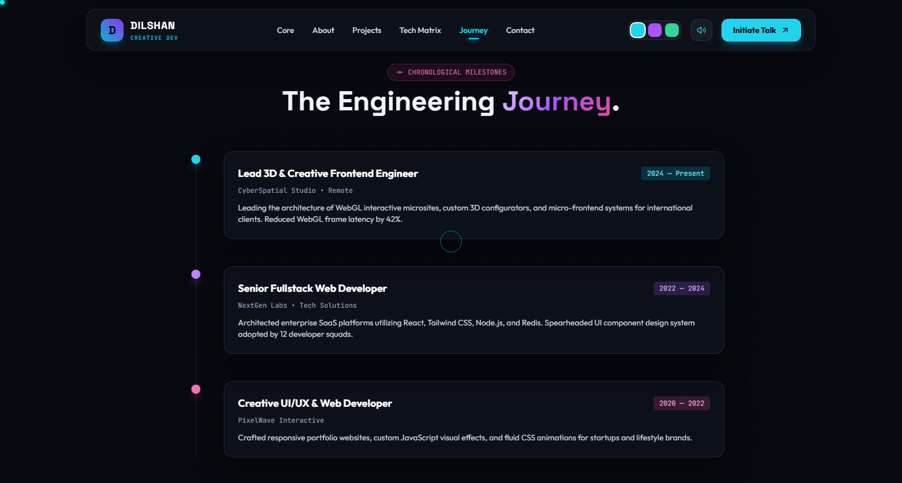
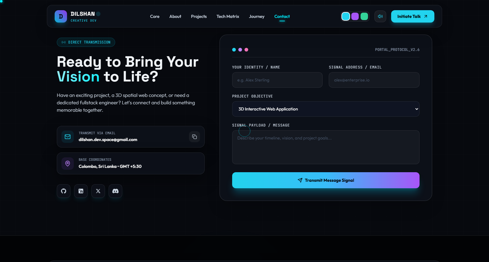

# ⚡ Dilshan | Creative 3D Developer & Spatial UI Engineer

<div align="center">

[](https://developer.mozilla.org/en-US/docs/Web/HTML)
[](https://tailwindcss.com/)
[](https://threejs.org/)
[](https://developer.mozilla.org/en-US/docs/Web/JavaScript)
[](https://www.khronos.org/webgl/)
[](#)
[](LICENSE)

<br/>

**A next-generation personal portfolio website blending cinematic WebGL 3D spatial computing, interactive cyber aesthetics, and glassmorphic UI engineering.**

[🚀 Explore Live Demo](#-quick-start) • [📸 Visual Showcase](#-visual-showcase) • [🛠️ Core Features](#-features--architecture) • [⚡ Getting Started](#-quick-start)

</div>

---

## 🌟 Hero Preview

<div align="center">
  
</div>

---

## 📑 Table of Contents

- [🚀 Overview](#-overview)
- [📸 Visual Showcase](#-visual-showcase)
- [🛠️ Features & Architecture](#-features--architecture)
- [💻 Tech Stack](#-tech-stack)
- [📁 Project Structure](#-project-structure)
- [⚡ Quick Start](#-quick-start)
- [🎨 Customization Guide](#-customization-guide)
- [📬 Author & Contact](#-author--contact)
- [📄 License](#-license)

---

## 🚀 Overview

This repository contains the official portfolio codebase for **Dilshan**, a Creative 3D Developer & Spatial UI Engineer. Engineered with a futuristic cyber dark mode aesthetic, high-frame-rate Three.js particles, and interactive 3D physics cards, the application delivers an unforgettable digital experience for visitors, recruiters, and clients.

### Highlights:
- 🌌 **Real-Time 3D Interactive WebGL Canvas**: Three.js particle vortex responding dynamically to mouse drag, inertia, and click bursts.
- 🪟 **Futuristic Glassmorphism & Cyber HUD**: Deep translucent backdrop filters, neon glowing borders, and floating diagnostic stats.
- 🎨 **Multi-Spectrum Theme Engine**: Real-time palette switching between **Cyan Neon**, **Violet Pulse**, and **Matrix Emerald**.
- 🔊 **Synthesized Web Audio FX**: Built-in micro-sound effects using HTML5 Web Audio API oscillators (no heavy audio files required).
- 📱 **Adaptive Responsive Design**: Flawlessly engineered across ultra-wide monitors, laptops, tablets, and smartphones.

---

## 📸 Visual Showcase

### 1. 🌌 Interactive 3D Hero & HUD System Diagnostic
> Real-time Three.js spatial core with interactive mouse manipulation, particle explosion on click, and live telemetry HUD diagnostics.

<p align="center">
  
</p>

---

### 2. 👤 Holographic Architect Bio & About
> 3D tilt holographic profile avatar card with glowing neon aura, live availability status, and core architecture philosophies.

<p align="center">
  
</p>

---

### 3. 💼 Featured Portfolio Showcases & Category Filters
> Dynamic portfolio cards with 3D tilt hover physics, quick tech badges, and category filters (`All`, `3D & Spatial`, `Fullstack SaaS`, `AI Systems`).

<p align="center">
  
</p>

---

### 4. 🔍 Deep Project Specs Modal Viewer
> Interactive modal displaying engineering highlights, simulated low-latency telemetry (18ms, 60 FPS, 99.99% uptime), and comprehensive tech stack badges.

<p align="center">
  
</p>

---

### 5. ⚡ The Tech Matrix & Capabilities Arsenal
> Multi-column skill breakdown covering **3D & Spatial Computing**, **Next-Gen Frontend**, and **Cloud Fullstack Core** with animated proficiency indicators.

<p align="center">
  
</p>

---

### 6. ⏳ Chronological Milestones & Engineering Journey
> Cyberpunk milestone timeline tracking career leadership, WebGL performance optimization, and enterprise fullstack SaaS delivery.

<p align="center">
  
</p>

---

### 7. 📡 Transmission Portal & Telemetry Footer
> Functional contact channel with instant clipboard copying, transmission message form, social connection icons, and live local station time synchronization.

<p align="center">
  
</p>

---

## 🛠️ Features & Architecture

| Feature | Description |
| :--- | :--- |
| **Interactive Three.js Core** | 3D particle vortex rendered with `WebGLRenderer`, custom particle geometry, mouse inertia tracking, and click particle explosion effects. |
| **Audio Synthesizer** | Pure Web Audio API procedural sound generation for subtle cyber clicks and notification feedback. |
| **VanillaTilt 3D Physics** | Gyroscope and mouse-following 3D perspective depth applied to HUD panels, avatars, and project showcase cards. |
| **Spectrum Palette Switcher** | Instant theme recoloring between Cyan Neon (`#00f0ff`), Violet Pulse (`#a855f7`), and Matrix Emerald (`#10b981`). |
| **Dynamic Project Modal** | Deep case study overlay with simulated telemetry, feature lists, and keyboard support (`Esc` to close). |
| **Animated Stats Counters** | Viewport-triggered numerical increment animations for shipped projects, years of experience, and customer satisfaction. |
| **Custom Glowing Cursor** | Fluid cursor dot & trailing outline with smooth interpolation on desktop viewports. |
| **Station Live Time Clock** | Real-time synchronized telemetry clock in the footer displaying GMT/local node time. |

---

## 💻 Tech Stack

<div align="center">

| Core Frontend | 3D & Graphics | Utilities & Icons |
| :---: | :---: | :---: |
| [](https://developer.mozilla.org/en-US/docs/Web/HTML) | [](https://threejs.org/) | [](https://lucide.dev/) |
| [](https://tailwindcss.com/) | [](https://www.khronos.org/webgl/) | [](https://micku7zu.github.io/vanilla-tilt.js/) |
| [](https://developer.mozilla.org/en-US/docs/Web/JavaScript) | [](https://developer.mozilla.org/en-US/docs/Web/API/Web_Audio_API) | [](https://fonts.google.com/) |

</div>

---

## 📁 Project Structure

```bash
02/
├── index.html                 # Main single-page application entry point
├── README.md                  # Comprehensive documentation with visual screenshots
├── assets/                    # Image assets & project media
│   ├── avatar.jpg             # Dilshan's 3D holographic avatar image
│   ├── project1.jpg           # DataSphere 3D AI Platform preview
│   ├── project2.jpg           # Aero-X 3D Cyber Commerce preview
│   └── project3.jpg           # NeuraFlow Cognitive Graph preview
├── css/
│   └── style.css              # Custom cyber grid, animations, glassmorphism & cursors
├── js/
│   ├── 3d-scene.js            # Three.js 3D WebGL particle scene, physics & interactions
│   └── main.js                # App state, theme switcher, modal viewer, audio FX & forms
└── screenshots/               # High-resolution portfolio previews for documentation
    ├── 00_full_page_overview.png
    ├── 01_hero_preview.png
    ├── 02_about_section.png
    ├── 03_featured_projects.png
    ├── 04_project_modal.png
    ├── 05_tech_matrix.png
    ├── 06_experience_timeline.png
    └── 07_contact_transmission.png
```

---

## ⚡ Quick Start

No complex build pipeline or package installation is required. You can run this project instantly using any static web server:

### Option 1: VS Code Live Server
1. Open the project folder in VS Code.
2. Right click `index.html` and select **"Open with Live Server"**.

### Option 2: Python Static Server
```bash
# In the project directory:
python -m http.server 8080
```
Then visit [`http://localhost:8080`](http://localhost:8080) in your browser.

### Option 3: Node.js `npx serve`
```bash
npx serve .
```

### Option 4: Direct Browser Launch
Simply double-click `index.html` to open it in your default web browser!

---

## 🎨 Customization Guide

### 1. Modifying Your Profile & Information
Open [`index.html`](index.html) and search for:
- **Name & Title**: Line 75 (`DILSHAN`), Line 78 (`Creative Dev`)
- **Bio & Mission**: Line 365 (`About Bio & Mission`)
- **Contact Email**: Line 896 (`dilshan.dev.space@gmail.com`)
- **Social Media Links**: Lines 915–942 (GitHub, LinkedIn, X, Discord)

### 2. Adding / Editing Projects
Projects are configured in [`index.html`](index.html#L446) and their detailed modal data in [`js/main.js`](js/main.js):
```javascript
const projectData = {
  1: {
    title: "Your Project Name",
    category: "SaaS / Web3D",
    img: "assets/your-project.jpg",
    desc: "Detailed project description...",
    latency: "12ms",
    uptime: "99.99%",
    fps: "60 FPS",
    features: [
      "Custom feature point 1",
      "Custom feature point 2"
    ],
    tech: ["React", "Three.js", "Tailwind CSS"]
  }
};
```

### 3. Adjusting 3D Particle Settings
In [`js/3d-scene.js`](js/3d-scene.js), you can easily modify:
- `particleCount = 1800` (Increase or decrease particle density)
- `camera.position.z = 85` (Adjust default zoom)
- Color themes and rotation speed.

---

## 📬 Author & Contact

**Dilshan** — Creative 3D Developer & Spatial UI Engineer

<div align="left">

[](https://github.com/Dilshan615)
[](https://linkedin.com)
[](mailto:dilshan.dev.space@gmail.com)
[](#)

</div>

---

## 📄 License

This project is licensed under the **MIT License** — feel free to customize and use it for your personal portfolio and commercial creations.

<div align="center">
  <sub>Designed & engineered with ❤️ by Dilshan. Architected for visual excellence.</sub>
</div>
